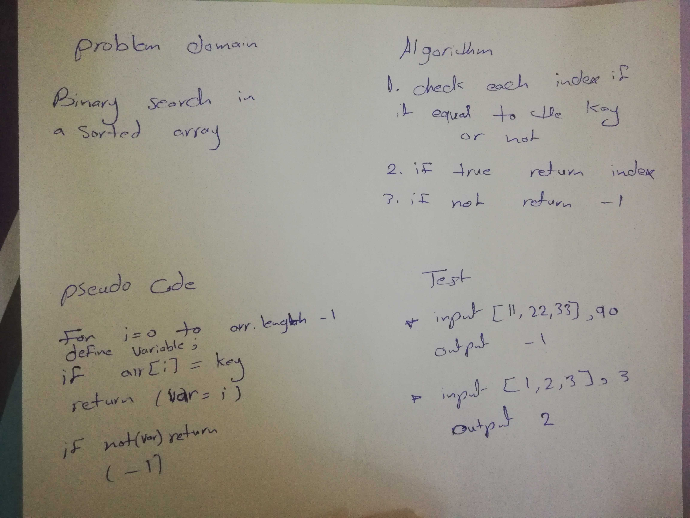

# Challenge Summary
Binary search in a sorted 1D array
## Challenge Description
function called BinarySearch which takes in 2 parameters: a sorted array and the search key. 
It return the index of the array’s element that is equal to the search key, or -1 if the element does not exist.
## Approach & Efficiency
1. check each index if it equal to the key or not 
2. if true assign the index to defined variable 
3. at the end it not variable = true then return -1 .

## Solution

