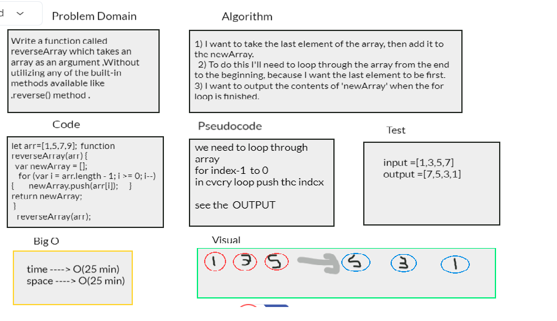

# Reverse an Array
1) I want to take the last element of the array, then add it to the newArray. 
2) To do this I'll need to loop through the array from the end to the beginning, because I want the last element to be first.
3) I want to output the contents of 'newArray' when the for loop is finished.
## Challenge
I have to Write a function called reverseArray which takes an array as an argument ,Without utilizing any of the built-in methods available like .reverse() method .

## Approach & Efficiency
I use for loop to reverse the array because it isn't allow to use any build in function .
But It's so easy ... it didn't take alot of time .

## Solution

