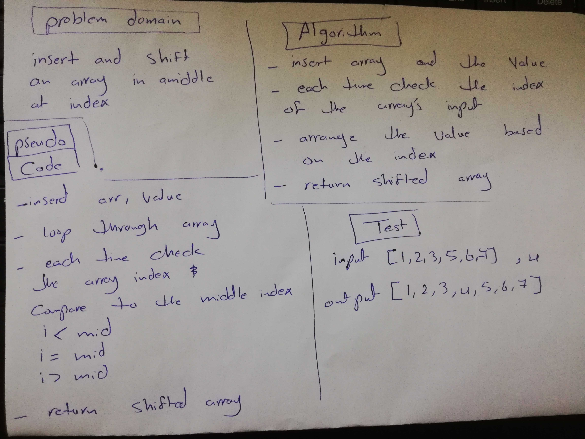

# Challenge Summary
Insert and shift an array in middle at index

## Challenge Description
 function called insertShiftArray which takes in an array and the value to be added ,then push this value to the middle of array
## Approach & Efficiency
break problem into a small blocks so we can understand how it work
## Solution

