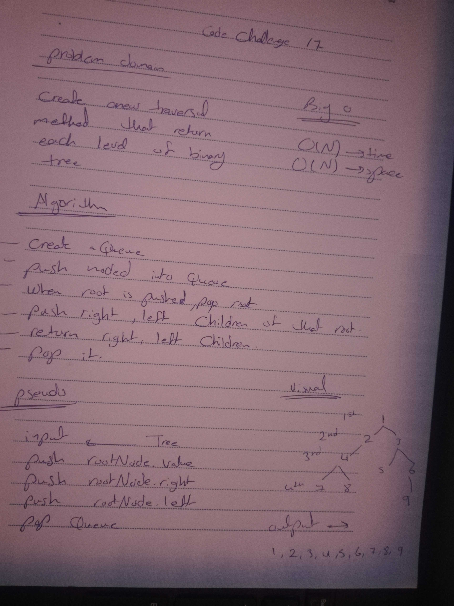

# Challenge Summary
Breadth-first Traversal.

## Challenge Description
Write a function called breadthFirstTraversal which takes a Binary Tree as its unique input. Without utilizing any of the built-in methods available to your language, traverse the input tree using a Breadth-first approach; print every visited node’s value.
## Approach & Efficiency
big o : O(n)
## Solution

