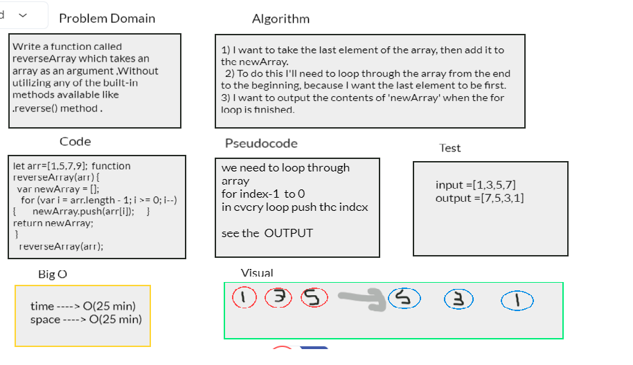

# Challenge Summary
this challenge is to build class for animal-shelter.
## Challenge Description
Create a class called AnimalShelter which holds only dogs and cats. 
The shelter operates using a first-in, first-out approach.
## Approach & Efficiency
enqueue(),dequeue() :
O(1) --> time
O(1)-->space
## Solution

