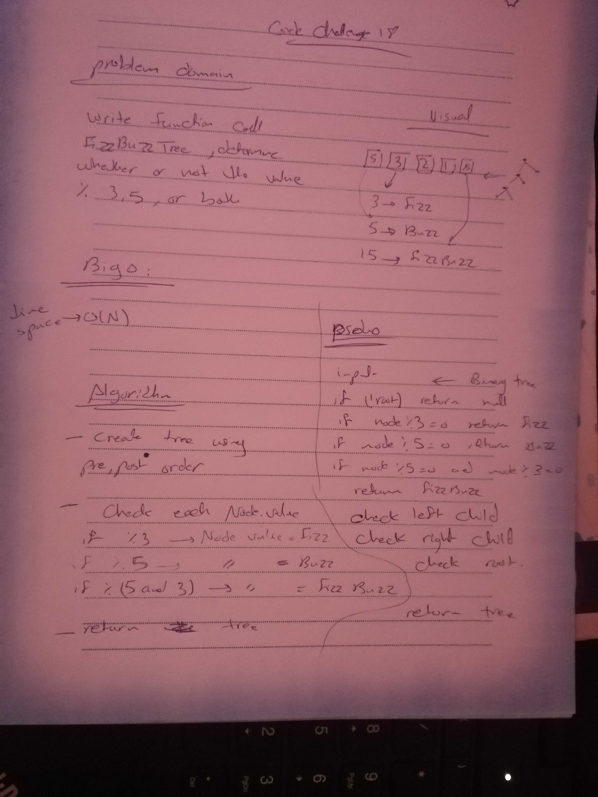

# Challenge Summary
In graph theory, an k-ary tree is a rooted tree in which each node has no more than k children.
A binary tree is the special case where k = 2, and a ternary tree is another case with k = 3 that limits its children to three.
## Challenge Description
Write a function called FizzBuzzTree which takes a k-ary tree as an argument.
Without utilizing any of the built-in methods available to your language, determine whether or not the value of each node is divisible by 3, 5 or both.
Return the tree with it’s news values.
## Approach & Efficiency
big o =>O(n)
## Solution
- 
