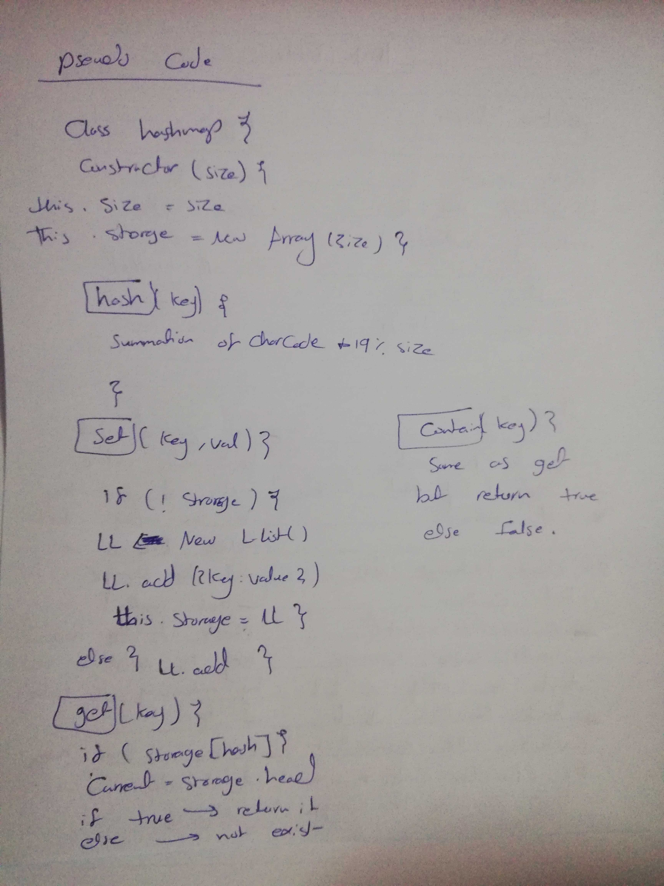

# Hashtables
- Hash table is a data structure that implements an associative array abstract data type, a structure that can map keys to values. 
- A hash table uses a hash function to compute an index, also called a hash code, into an array of buckets or slots, from which the desired value can be found
## Challenge
- Implement a Hashtable with the following methods:

1. add: takes in both the key and value. This method should hash the key, and add the key and value pair to the table, handling collisions as needed.
2. get: takes in the key and returns the value from the table.
3. contains: takes in the key and returns a boolean, indicating if the key exists in the table already.
4. hash: takes in an arbitrary key and returns an index in the collection.
## Approach & Efficiency
Big O
add() , set(), get(), contain()

- time => O (1)
- space O (1) 
- because there is no ant type loop to check for each element in the array.
## API
- 
- 
