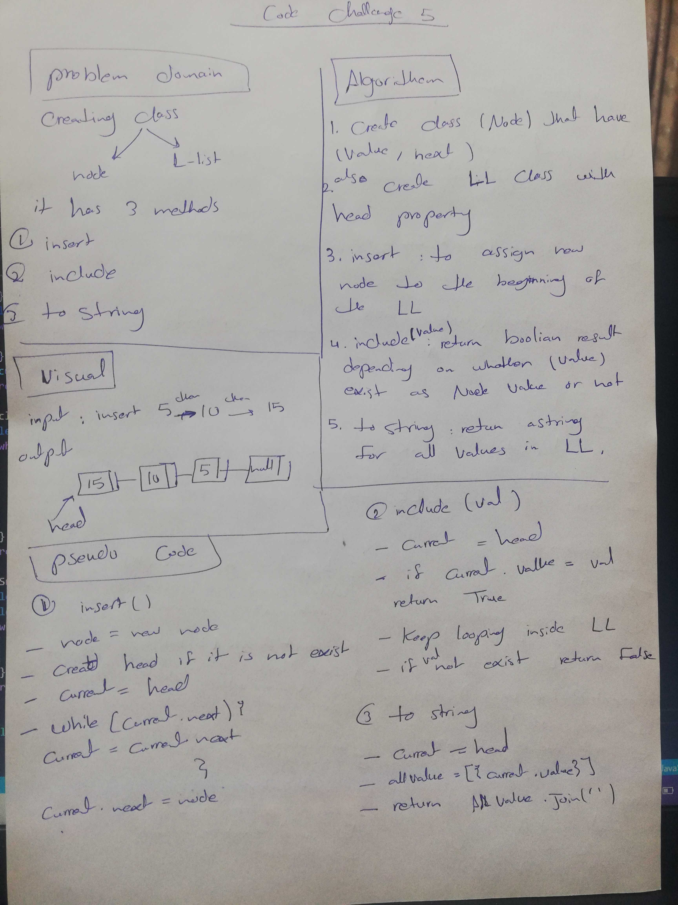
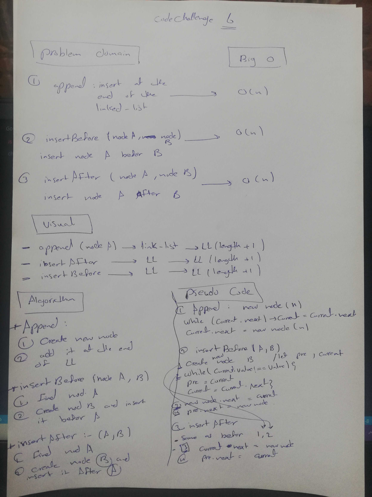
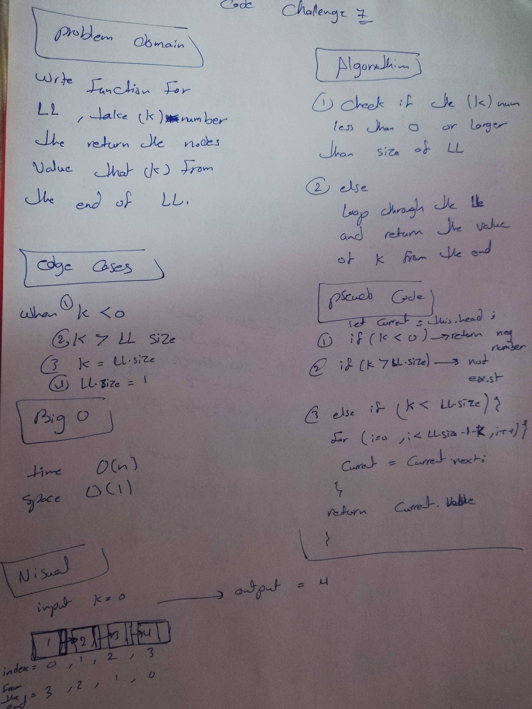

# Singly Linked List
Represent how linked list  work and linked to each other as a object chain

## Challenge
k-th value from the end of a linked list.
## Approach & Efficiency
use constructor , class and  for loop

### big O 

- insert : space O(1) , time O(1)
- includes :  space O(n) , time O(1)
- to string :  space O(n) , time O(1)
- append :  space O(n) , time O(1)
- insertBefore:  space O(n) , time O(1)
- insertAfter :  space O(n) , time O(1)
- k value : space 0(1) ,time 0(n)

## API
- insert method : takes any value as an argument and adds a new node with that value to the head of the list with an O(1) Time performance.
- includes method : takes any value as an argument and returns a boolean result depending on whether that value exists as a Node’s value somewhere within the list.
- toString method : takes in no arguments and returns a string representing all the values in the Linked List, formatted as:
"{ a } -> { b } -> { c } -> NULL"
- append :adds a new node with the given value to the end of the list
- insertBefore : add a new node with the given newValue immediately before the first value node
- insertAfter : add a new node with the given newValue immediately after the first value node
- valOfK : return k-th value from the end of a linked list.

# white board lab 5

## white board lab 6

# white board lab 7
