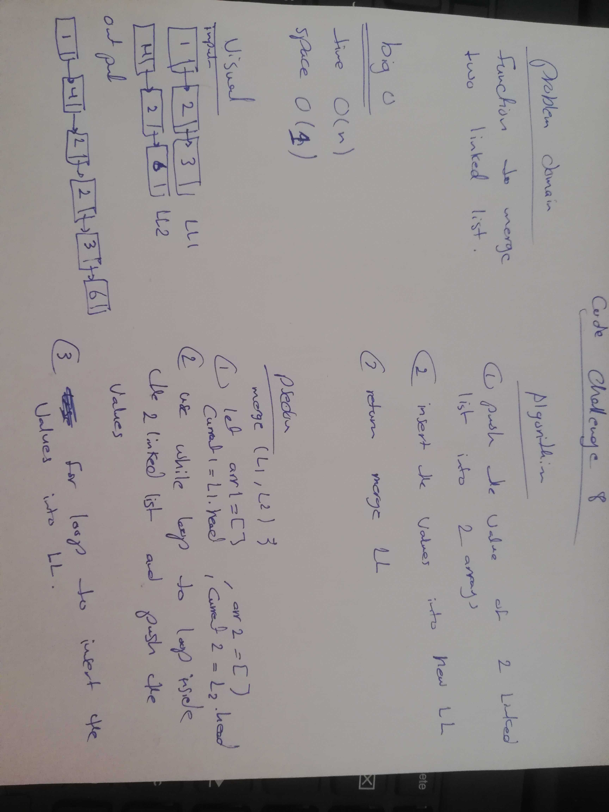

# Challenge Summary
Merge two linked lists.

## Challenge Description
Write a function called mergeLists which takes two linked lists as arguments. Zip the two linked lists together into one so that the nodes alternate between the two lists and return a reference to the head of the zipped list.
## Approach & Efficiency
while loop for pushing the values inside the linked list to array 
and for loop for inserting 
## Solution

