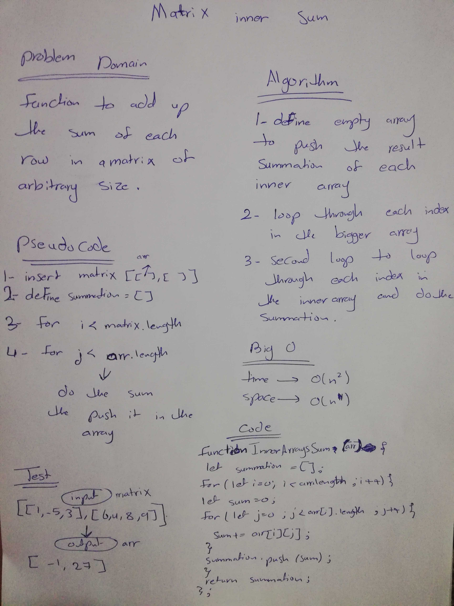
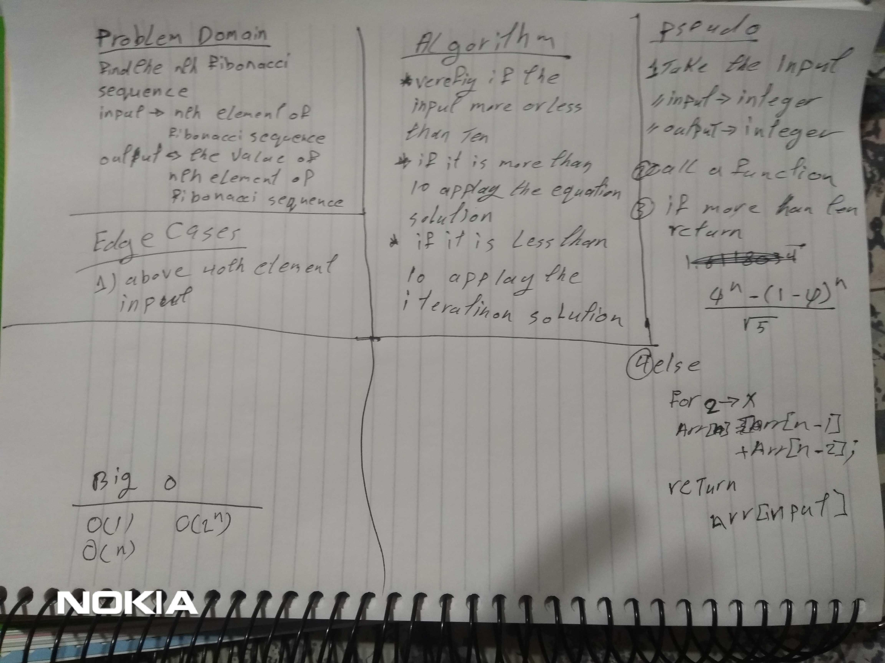

# Challenge Summary
 write tow  function and test it for different problem :
 - the first for matrix inner sum 
 - the second for generate the nth Fibonacci number .

# Challenge Description

* Two problem :

- first  : given a matrix, find the sum of each row then return array with apporioate lenght.

- second : generate the nth Fibonacci number, 2 different ways.

# UML

- 
 
- 

# Done by :

- Reham Omar
- Ahmad Kmal