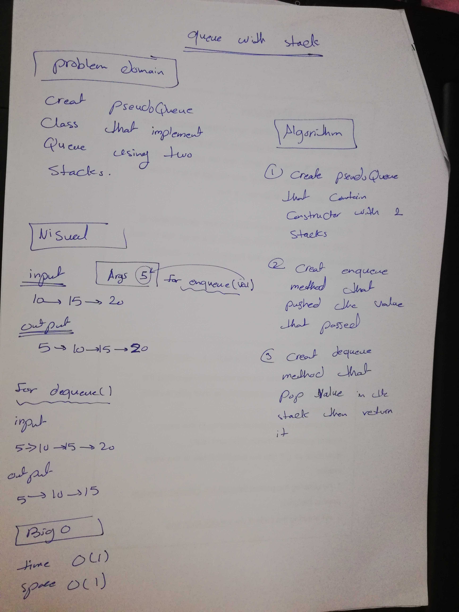

# Challenge Summary

Implement a Queue using two Stacks.

## Challenge Description

- Create a brand new PseudoQueue class.
- this PseudoQueue class will implement our standard queue interface (the two methods listed below), but will internally only utilize 2 Stack objects. 
- create your class with the following methods:

1. `enqueue(value)` which inserts value into the PseudoQueue, using a first-in, first-out approach.
2. `dequeue()` which extracts a value from the PseudoQueue, using a first-in, first-out approach.

## Approach & Efficiency

big O for :
 time O(1)
 space O(1)

## Solution

