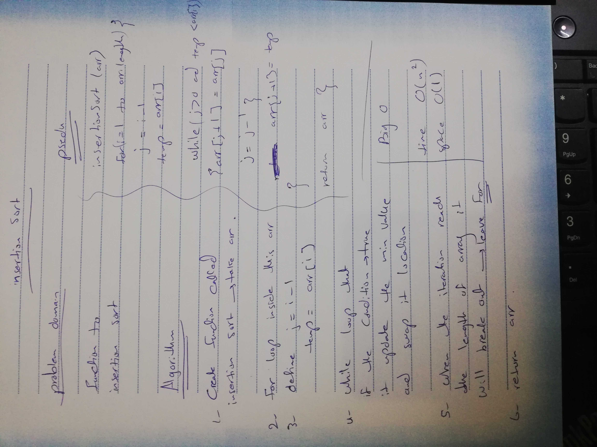

# Challenge Summary

Insertion sort is a simple sorting algorithm that sorted it from heigher values to the lowest.

## Challenge Description

Review the pseudocode below, then trace the algorithm by stepping through the process with the provided sample array. Document your explanation by creating a blog article that shows the step-by-step output after each iteration through some sort of visual.

## Approach & Efficiency
big o :
time=> O(n^2)
space => O(1)

**Sample Array: [8,4,23,42,15]**
Pass 1:
In the first pass through of the selection sort, we evaluate if there is a smaller number in the array than what is currently present in index 0. We find this smaller number right away in index 1. The minimum value gets updated to remember this index. At the end of the evaluation, the smaller number will be swapped with the current value in index i. This results in our smallest number of our array being placed first.
[4,8,23,42,15]

pass 2:
The second pass through the array evaluates the remaining values in the array to see if there is a smaller value other than the current position of i. 8 is the 2nd smallest number in the array, so it “swaps” with itself. The minimum value does not change at all during the iteration of this pass.
[4,8,23,42,15]

pass 3 :
The third pass through evaluates the remaining indexes in the array, starting at position 2. Both position 4 and 5 are smaller than the value in position 2. Each time a smaller number than the current minimum is found, the variable will update to the new smallest number. In this case, 15 is the next smallest number. As a result, it will swap with position 2.
[4,8,15,42,23]

pass 4 :
The 4th pass through on the array proves that 23 is the next smallest number in the array, and as a result, switches places with the 42.
[4,8,15,23,42]

pass 5 :
 On its final iteratation through the array, it will swap places with itself as it evaluates the value against itself.
[4,8,15,23,42]

After this iteration, i will increment to 5, forcing it to break out of the outer for loop and leaving our array now sorted.
## Solution

