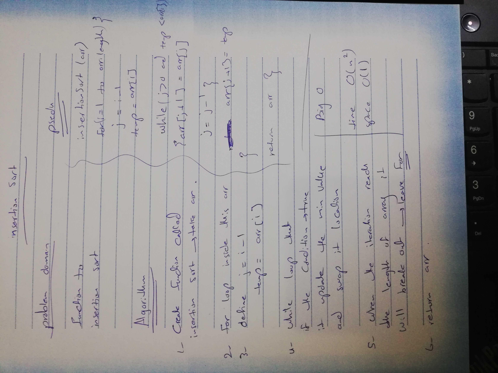

# Challenge Summary

Insertion sort is a simple sorting algorithm that sorted it from heigher values to the lowest.

## Challenge Description

Review the pseudocode below, then trace the algorithm by stepping through the process with the provided sample array. Document your explanation by creating a blog article that shows the step-by-step output after each iteration through some sort of visual.

## Approach & Efficiency
big o :
time=> O(n^2)
space => O(1)

## Solution

