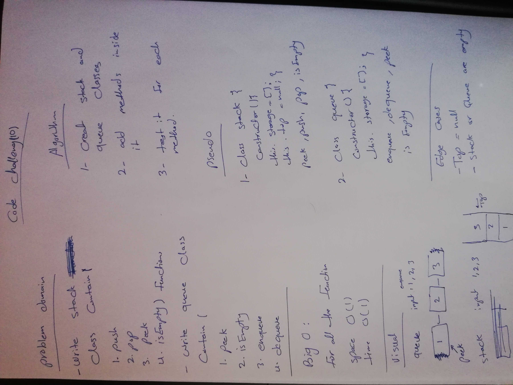

# Stacks and Queues

- Stacks are based on the LIFO principle, i.e., the element inserted at the last, is the first element to come out of the list.
- Queues are based on the FIFO principle, i.e., the element inserted at the first, is the first element to come out of the list.

## Challenge
- Create a Node class that has properties for the value stored in the Node, and a pointer to the next node.
- Create a Stack class that has a top property. It creates an empty Stack when instantiated.
## Approach & Efficiency
- Create anew class name `stack` contains (
    1. peek : does not take an argument and returns the value of the node located on top of the stack, without removing it from the stack.
    2. push :  takes any value as an argument and adds a new node with that value to the top of the stack with an O(1) Time performance.
    3. pop :  does not take any argument, removes the node from the top of the stack, and returns the node’s value.
    4. isEmpty :  takes no argument, and returns a boolean indicating whether or not the stack is empty.
) functions .

- Create anew class name `queue` contains (
    1. peek : does not take an argument and returns the value of the node located on top of the stack, without removing it from the stack.
    2. enqueue :   takes any value as an argument and adds a new node with that value to the back of the queue with an
    O(1) Time performance.
    3. dequeue :  does not take any argument, removes the node from the front of the queue, and returns the node’s value.
    4. isEmpty :  takes no argument, and returns a boolean indicating whether or not the stack is empty.
) functions .
### Big O :
- All the finction befor are O(1)space , O(1) time because it just add or remove vlue and there is no iteration needed .
## white board 

